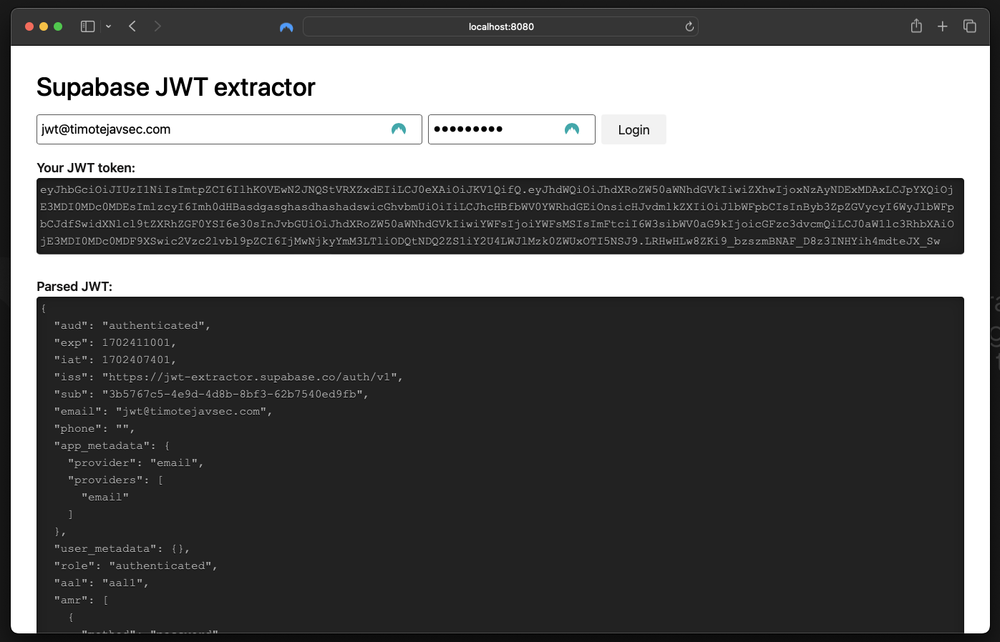

# Supabase JWT extractor

This simple and minimalist HTML file can be used to obtain JWT from [Supabase](https://www.supabase.co) user credentials. This can be used to debug and develop
Edge Functions (to emulate users) or just to simply debug the JWT token.



## Setup

First, update the Supabase credentialse in `index.html`

```js
const supabaseUrl = '<SUPABASE_URL>';
const supabaseKey = '<SUPABASE_ANON_KEY>';
```

Then just serve the `index.html` file.

After opening the site, enter email and password. If the credentials are valid, JWT (and parsed JWT) will be displayed.

## Future/improvements

This site currently only supports login with email and password. I plan on adding support for OAuth authentication.
